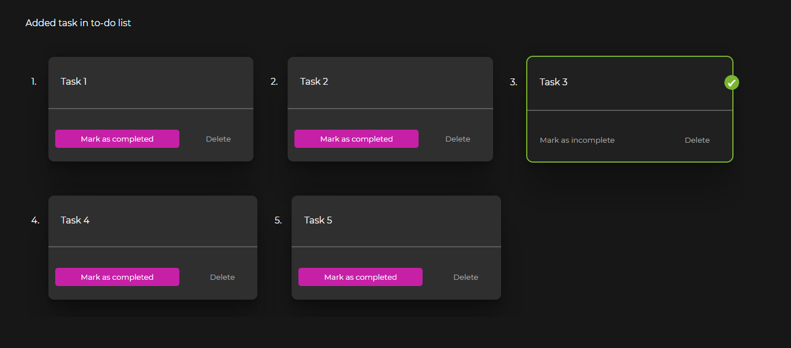

# To-Do List


## Demo

A demo of this assignment can be found on this [link](https://revirt-todo-list-fnoczpilu-sahil9510.vercel.app/)

## Built With
```
MERN Stack
```

- [ReactJS](https://reactjs.org/)
- [NodeJS](https://nodejs.org/en/)
- [Express](https://expressjs.com/)
- [MongoDB](https://www.mongodb.com/)


## Setup
Download [Node.js](https://nodejs.org/en/download/).
Run this followed commands:

``` bash
# Install dependencies (only the first time)
npm install

# Run the local server at localhost:8080
npm run dev

# Build for production in the dist/ directory
npm run build
```
## Note
```
 All features are provided and can be verified.
 (Including the both bonus features)
 ```

 ## Backend Code:
 To run the backend on the localhost, do the following:

1. 
```bash
cd .\backend\
npm install
```
2. Make am env file
```js
DB_URL =  // Insert the connect URL from MongoDB atlas page.
````

3.
```bash
npm start
```

## Model

Main List:


<br/>
Filtering:

<br/>
Adding new task:

<br/>
Responsive showcase:
<br/>


